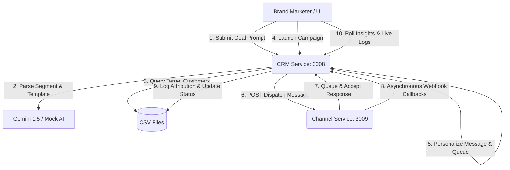

# Xeno AI-Native Mini CRM & Channel Service

Welcome to the **Xeno AI-Native Mini CRM**! This is a complete, production-ready implementation of the Xeno Engineering Take-Home Assignment. It features a modern, responsive, glassmorphic Dark Mode dashboard and an asynchronous, webhook-driven channel communication loop with full analytics tracking.

---

## 🚀 Key Features

1. **AI-Native Campaign Assistant**
   - Submit campaign goals in plain English (e.g., *"Win back inactive shoppers who haven't bought in 60 days"* or *"Target Gold tier loyalty members who purchased shoes"*).
   - Generates a segment criteria definition, suggests a personalized template, and titles the campaign automatically.
   - Integrates directly with the **Gemini 1.5 Flash** model (with fallback to mock parsing if no API key is set).
2. **Dynamic Shopper Database Ingestion**
   - Seeds SQLite database instantly with initial customer profiles, loyalty tiers, geographic/demographic metadata, and realistic order histories.
3. **Personalized Communication Dispatcher**
   - Matches segments automatically, builds tailored outreach messages for each shopper using AI parameters (replacing placeholders like `{{name}}` and referencing their last purchased item), and posts to the simulated Channel Service.
4. **Real-time Funnel Simulation & Callbacks**
   - Asynchronous callbacks simulate live messaging events (**Sent $\rightarrow$ Delivered $\rightarrow$ Opened/Read $\rightarrow$ Clicked $\rightarrow$ Converted**).
   - The UI polls progress live, rendering real-time animated funnel charts and list feeds of attributed conversions.
5. **Campaign Performance Insights & ROI Metrics**
   - Automatically tracks financial stats: **Attributed Revenue**, **Campaign Cost** (WhatsApp $0.08, SMS $0.02, RCS $0.05, Email $0.002), **Net Profit**, and **ROI**.

---

## 🛠️ Tech Stack

- **Backend:** Node.js, Express, TypeScript, ts-node
- **Database:** Serverless-native CSV files (active reading/writing to temporary directory `/tmp` on serverless and local `tmp/` folder, pre-seeded from git)
- **AI Integration:** `@google/generative-ai` (Gemini 1.5 Flash)
- **Frontend:** Vanilla HTML5, CSS3 (Custom Glassmorphic design variables, responsive grid systems, keyframe micro-animations), Vanilla JavaScript ES6
- **Task Runner:** concurrently (to launch services together)

---

## 📐 System Architecture

The project is structured as a decoupled **Two-Service Architecture**:



### Decoupled Workflow & State Machine
1. **Accept Request:** CRM accepts send request, persists `CommunicationLog` entries in `PENDING` state, and forwards message dispatch to the Channel Service.
2. **Channel Acceptance:** The Channel Service validates the payload and immediately responds with `202 Accepted` to free up CRM HTTP threads.
3. **Asynchronous Lifecycle:** The Channel Service simulates events in the background, executing POST webhook callbacks to the CRM's `/api/receipts/callback` route.
4. **Attribution & Completion:** When the CRM receives a `CONVERTED` event, it appends a new purchase order to the customer and logs the timestamp. Once no logs remain in active states, the campaign is finalized as `COMPLETED`.

---

## ⚖️ Scalability, Trade-offs & Production Design

For the scope of this assessment, a lightweight CSV database engine and in-memory states are utilized. This completely avoids SQLite file locks and compilation restrictions on serverless environments. To scale this system to **millions of messages and real-time events**, the following tradeoffs are noted:

### 1. Database Layer (CSV / SQLite vs. PostgreSQL/Redshift)
*   **Current:** CSV files are excellent for portability and zero-config deployment.
*   **Scale:** In production, we would replace this with **PostgreSQL** (with read replicas for analytics) and ingest high-volume transactions into data warehouses like **Redshift** or **BigQuery** for long-term ROI attribution.

### 2. Message Dispatch Queueing (Direct HTTP vs. Message Broker)
*   **Current:** The CRM maps dispatches via HTTP requests using `Promise.all()`. For hundreds of shoppers this is fine, but for millions, it would crash or timeout.
*   **Scale:** We would introduce a distributed task queue like **BullMQ (Redis-backed)** or a message broker like **RabbitMQ** / **Apache Kafka**. The CRM pushes dispatch tasks to the broker, and separate worker microservices consume tasks and throttles dispatches according to channel rate limits.

### 3. Webhook Delivery & Ingestion (Direct Express vs. Stream Ingestion)
*   **Current:** Receipts hit Express directly, updating active data rows immediately. High volumes would block the event loop.
*   **Scale:** Webhooks would hit an API Gateway (e.g. AWS API Gateway / Cloudflare Workers) which instantly dumps them to a stream partition (e.g., Kafka / AWS Kinesis). Consumer workers ingest these in batches, updating database records asynchronously, preventing web server bottlenecks.

---

## 🏃 Setup & Running Locally

### Prerequisites
- Node.js (v18 or higher)
- npm (v9 or higher)

### 1. Install Dependencies
```bash
npm install
```

### 2. Configure Environment Variables
Copy `.env` file or verify that the ports are configured:
```env
PORT_CRM=3008
PORT_CHANNEL=3009
GEMINI_API_KEY="" # Add your Gemini API Key here to enable live AI parsing
```

### 3. Launch the Development Servers
Start both the CRM Server and the Channel Simulator concurrently (the CSV database files will be initialized automatically in a local `tmp/` folder):
```bash
npm run dev
```
Once started:
*   The **CRM and Frontend Console** is available at: **`http://localhost:3008`**
*   The **Channel Service API** is available at: **`http://localhost:3009`**

### 4. Run the End-to-End Test Suite
To execute the automated end-to-end integration test through the console:
```bash
npm run test-flow
```

---

## 🧪 Verification Plan

1. **Seeding:** Open the UI, click **Seed/Reset DB**, and verify the Shoppers tab populates with 8 initial customer rows.
2. **AI Goal Parsing:** In the Dashboard tab, select or type a prompt (e.g., *"Win back customers who haven't bought anything in 60 days"*), and click **Parse Campaign Goal**. Check the generated criteria, template copy, and campaign name.
3. **Dispatch & Callbacks:** Choose a channel (e.g., WhatsApp) and click **Launch Campaign**. The UI will open the Live Funnel and poll the statistics, rendering the progress bars sliding forward.
4. **ROI Attribution:** Confirm that converted customers trigger new purchases that automatically add to the "Attributed Revenue" counter.
